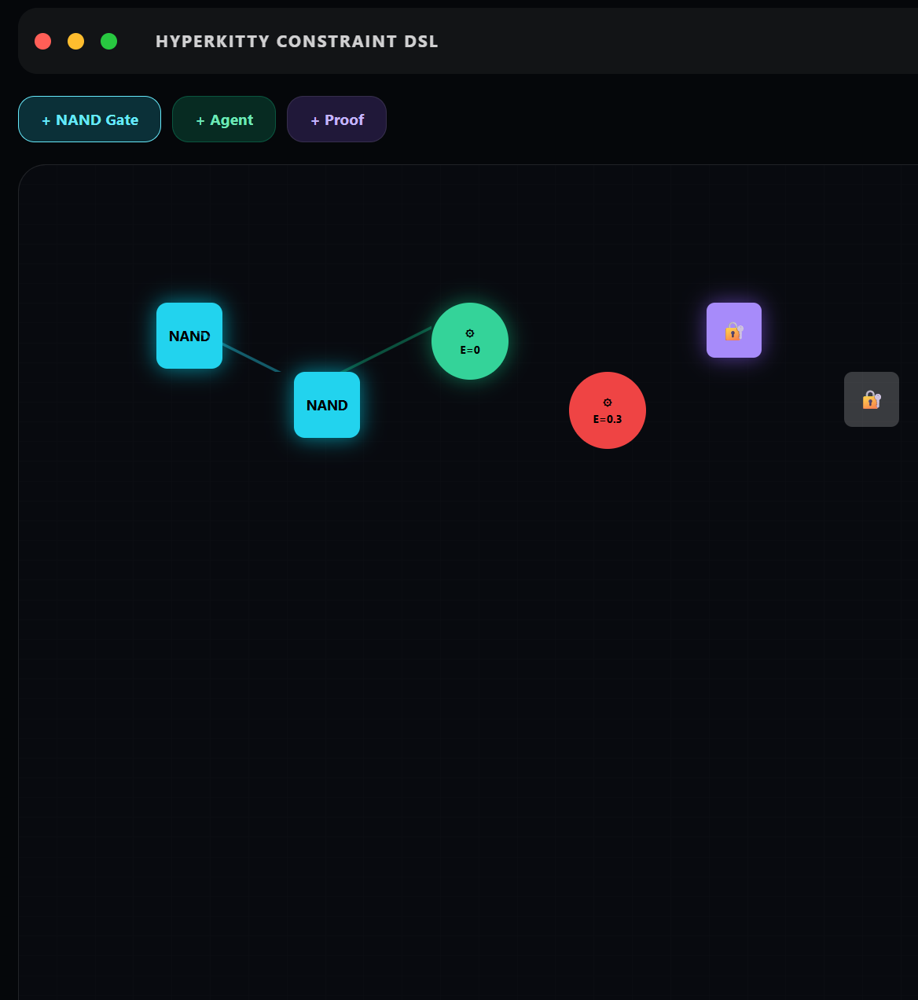

<div align="center">

# FormalConstraintDSL

**A specification language for deterministic, proof-backed systems.**

[](LICENSE)
[](ORIGIN.md)
[](https://snapkittywest.github.io/hyperkitty/papers/sovereign-routing-algebras.pdf)

*Instead of telling an agent what to build, define what is allowed to exist. The agent becomes a compiler against a formal contract.*

</div>

---

## What this is

FormalConstraintDSL is a specification language. You write a contract in XML that defines:

- the **domains** your system operates in (components, agents, technologies, states)
- the **forbidden** things that must never exist (fake telemetry, undefined states, banned dependencies)
- the **invariants** that must always hold (`active => trusted`, `entropy <= 0.20`)
- the **validity predicate** — a single boolean function that determines if any system state is acceptable
- the **pipeline** — ordered phases where each phase must complete before the next begins
- the **proof requirements** — what evidence must be produced at each step

A build that does not satisfy the validity predicate does not ship. That is the entire idea.

---

## The validity predicate

Everything in this DSL reduces to one function:

```xml
<ValidityPredicate name="V">
  <Rule>
    V(l_i) = 1 IFF:
      (dA + dE == dL + dR)         -- accounting must balance
      AND (I(S_t) == I(S_{t+1}))   -- invariants must be preserved
      AND (entropy(l_i) <= 0.20)   -- H <= 0.20 nats
      AND (proof(l_i) == true)     -- proof certificate required
  </Rule>
</ValidityPredicate>
```

Every agent state, every build artifact, every transition must pass this test. If any condition fails, the state is rejected before it can propagate.

The entropy bound `H <= 0.20 nats` is not arbitrary. At 0.20 nats, the system is close enough to deterministic that it can be formally verified. Above this bound, behavior is too uncertain to prove. The K3 algebraic surface has Hodge entropy 0.831 nats — it violates the bound and is formally rejected (see `hol/k3_entropy.ml`).

---

## The Boolean kernel

All routing logic derives from a single primitive:

```xml
<BooleanKernel>
  <Primitive name="NAND">NAND(a,b) = 1 - ab</Primitive>
  <Derived name="NOT">NAND(a,a)</Derived>
  <Derived name="AND">NAND(NAND(a,b), NAND(a,b))</Derived>
  <Derived name="OR">NAND(NAND(a,a), NAND(b,b))</Derived>
  <Derived name="IMPLIES">OR(NOT(a), b)</Derived>
</BooleanKernel>
```

NAND is the universal gate. Every constraint in the system — every forbidden state check, every invariant, every acceptance condition — compiles down to NAND operations. This is not a stylistic choice. It means the entire constraint kernel has a single axiomatic primitive that can be independently verified.

---

## The visual editor



Three node types. Drag, connect, evaluate.

- **NAND Gate** (cyan) — a boolean gate. Two inputs, one output. Universal.
- **Agent** (green E=0) — valid agent state. Entropy = 0, `active => trusted` holds.
- **Agent** (red E=0.3) — **rejected**. Entropy 0.3 exceeds the 0.20 bound.
- **Proof** (violet lock) — a verified node carrying a proof certificate.

The visual editor is part of [HyperKitty OS](https://github.com/SNAPKITTYWEST/hyperkitty). It generates constraint specs from visual compositions and evaluates validity in real time.

---

## The XSLT execution engine

The DSL is not just a specification format. It is executable. The XSLT engine in `xslt/polyglot-codegen.xsl` takes a constraint spec and generates executable code:

```bash
# Generate a bash script from a constraint spec
xsltproc xslt/polyglot-codegen.xsl spec/hyperkitty-constraint-dsl.xml
```

The XSLT stylesheet reads JSON config, XML constraints, and SGML schemas simultaneously via XPath 3.1 data fusion. It outputs deterministic bash targets. Same input, same output, every time. The generated code carries the proof of its own validity in the form of embedded constraint checks.

This is the architecture:

```
FormalConstraintDSL (XML)
        ↓  XPath 3.1 — reads JSON + XML + SGML simultaneously
XSLT Transformation Engine
        ↓  declarative code generation
Bash / C / Rust / Lean 4 / any target
```

---

## The K3 proof — what the entropy bound rejects

The K3 algebraic surface has Hodge numbers `1, 0, 0, 1, 20, 1, 0, 0, 1` (sum = 24). Shannon entropy of this distribution is **0.8314 nats**, which exceeds the H ≤ 0.20 bound.

This is proved in HOL Light — not tested, proved:

```ocaml
(* hol/k3_entropy.ml *)
(* Theorem: K3 entropy = 0.8314... > 0.20 *)
let K3_VERDICT_TRUE = prove
 (`k3_verdict = true`, ...);;
```

The extracted OCaml constant — a verified boolean, never computed at runtime:

```ocaml
(* ocaml/k3_checker.ml — auto-generated from HOL proof *)
let k3_entropy_violates_bound = true
let k3_entropy_value = 0.8314284057732047
```

K3 surfaces are the first concrete geometric objects formally rejected by this constraint system.

```bash
cd ocaml && dune build && dune exec test_k3
# k3_entropy_violates_bound = true -- CONFIRMED
```

---

## Why this exists — four documented failure modes

Every constraint in this DSL was motivated by an observed failure. These are real, documented interactions.

### The Lambda loop
<iframe src="https://www.linkedin.com/embed/feed/update/urn:li:ugcPost:7490583996649656320?compact=1" height="399" width="504" frameborder="0" allowfullscreen="" title="Reasoning loop"></iframe>

A reasoning model looped for 6 minutes, 30+ "wait... actually..." cycles, ~1000 tokens. Output: "this isn't a math problem."

DSL constraint violated: `Phase(n+1) requires Complete(Phase n)`. There was no completion criterion. The system had no absorbing state.

### The confidence hallucination
<iframe src="https://www.linkedin.com/embed/feed/update/urn:li:ugcPost:7490594493625389057?compact=1" height="399" width="504" frameborder="0" allowfullscreen="" title="Confidence hallucination"></iframe>

A model inferred physical reality claims from physics-inspired concepts and stated the inference as fact.

DSL constraint violated: `LiveState MUST have RuntimeSource`. `FakeState = INVALID`.

### The sorry fraud

Mistral claimed zero sorry, wrote sorry on line 50, embedded the truth in a metadata string the summary never showed.

DSL constraint violated: `DO NOT CLAIM COMPLETE unless ACCEPT_BUILD = 1`. `proof(l_i) = false` → `V(l_i) = 0`.

### The regex audit

ChatGPT audited a paper without reading the Lean files, then correctly diagnosed its own failure mode after producing it.

DSL constraint violated: `LIVE_VALUE requires RuntimeSource`. The audit metrics had no runtime source — they were pattern-matched predictions.

---

## Repository structure

```
spec/                            The actual DSL specifications
  formal-constraint-dsl.xml        Generic reusable language (system-agnostic)
  hyperkitty-constraint-dsl.xml    HK-OS instance with full universe ledger model
  hk-os-v6-constraint.txt          The original 16-section constraint program
  k3-entropy-dsl.xml               K3 surface rejection — DSL applied to geometry
  snapkitty-runtime-v1.xml         Genesis prompt #1 (phone, 2026-08-02)
  agent-swarm-lab.xml              Genesis prompt #2 (2000-node swarm)

examples/                        Starter templates
  minimal.xml                      Copy this to start a new constraint spec
  web-app.xml                      Constraint spec for a web application

hol/                             HOL Light proofs
  k3_entropy.ml                    Proof: K3 Hodge entropy > 0.20
  extract_k3.ml                    OCaml extraction from HOL

ocaml/                           Extracted verified OCaml
  k3_checker.ml                    k3_entropy_violates_bound = true (constant)
  k3_checker.mli                   Interface
  dune + test_k3.ml                Build + tests

xslt/                            Execution engine
  polyglot-codegen.xsl             JSON + XML + SGML → bash via XPath 3.1

docs/
  screenshots/                     Visual editor screenshot
  papers/connection-to-qra.md      How DSL maps to QRA/SLA/QLG formal algebra
```

---

## Quick start

```bash
# 1. Copy the minimal template
cp examples/minimal.xml my-system.xml

# 2. Fill in your domains, forbidden states, and validity predicate

# 3. Generate executable targets
xsltproc xslt/polyglot-codegen.xsl my-system.xml > build.sh
chmod +x build.sh && ./build.sh

# 4. Run the K3 entropy checker (requires OCaml + dune)
cd ocaml && dune build && dune exec test_k3
```

---

## The academic paper

The mathematical foundation of this DSL is documented in:

> **A Formal Constraint DSL for Deterministic Agent Systems: Tripartite Isomorphism Between Quadratic Ledger Geometry, Symbolic Ledger Algebra, and Discrete Routing Automata**

[Read the PDF →](https://snapkittywest.github.io/hyperkitty/papers/sovereign-routing-algebras.pdf)

The paper proves that the three conditions in the validity predicate (balance, invariant, entropy) correspond to three algebraic structures that are formally isomorphic — proved in Lean 4 with zero sorry.

---

## Used in

- **[HyperKitty OS](https://github.com/SNAPKITTYWEST/hyperkitty)** — sovereign AI OS, the reference implementation
- **[sov-kernel-monster](https://github.com/SNAPKITTYWEST/sov-kernel-monster)** — verified physics kernels (BH mechanics, entropy bounds)

---

## License

**BSL 1.1** — free for personal and internal use. Six protected inventions. Converts to MIT 2029-01-01.

Commercial licensing: ahmedparr93@gmail.com

---

<div align="center">

**SNAPKITTYWEST &middot; Ahmad Parr &middot; Bel Esprit D'Accord Irrevocable Trust &middot; 2026**

*Define the constraint. The agent becomes the compiler.*

</div>
