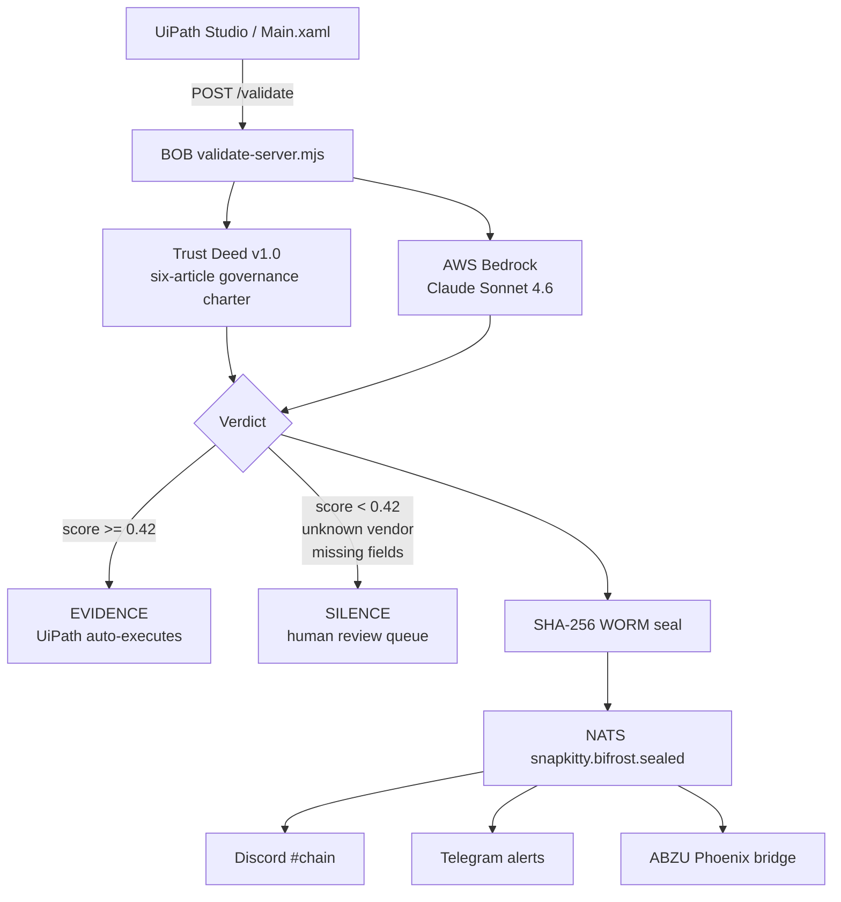

# BOB — Sovereign Compliance Agent

> Evidence or Silence. Nothing in between.

[](https://nodejs.org/)
[](https://aws.amazon.com/bedrock/)
[](#formal-guarantees)
[](#trust-deed-v10)
[](LICENSE)

## Navigation

| | |
|---|---|
| Run BOB locally | [Run BOB](#run-bob) |
| Architecture | [Architecture](#architecture) |
| Formal guarantees | [Formal guarantees](#formal-guarantees) |
| UiPath integration | [UiPath components](#uipath-components) |
| Sovereign infra | [../infra/](../infra/) |

## What BOB Does

BOB is a sovereign compliance agent for UiPath workflows.

A UiPath Robot submits a document or compliance query. BOB evaluates it under the **Bel Esprit D'Accord Trust Deed v1.0**, calls **Claude Sonnet 4.6 through AWS Bedrock**, and returns one of two verdicts:

```json
{
  "verdict": "EVIDENCE",
  "score": 0.87,
  "reasoning": "The invoice contains the required vendor, amount, and invoice ID fields.",
  "seal": "83c34fa2..."
}
```

- `EVIDENCE` — UiPath may continue the workflow.
- `SILENCE` — UiPath routes the case to human review.
- Every verdict is sealed with `SHA256(verdict:score:query:timestamp)`.

## Architecture



<details>
<summary><strong>ASCII Architecture</strong></summary>

```text
UiPath Studio -> Main.xaml -> POST localhost:7474/validate
                                  |
                                  v
                    BOB validate-server.mjs
                    - Claude Sonnet 4.6 via AWS Bedrock
                    - Trust Deed v1.0, six articles
                    - strict JSON verdict format
                    - threshold: score >= 0.42
                    - SHA-256 WORM seal
                                  |
                                  v
                    NATS snapkitty.bifrost.sealed
                    |-- Discord #chain verdict feed
                    |-- Telegram alert path
                    |-- ABZU Phoenix API bridge

Optional ABZU path:

UiPath -> POST /api/validate on Phoenix :4000
       -> NATS snapkitty.agents.operator
       -> BOB
       -> NATS snapkitty.bifrost.sealed
       -> Phoenix PubSub verdict:{request_id}
       -> UiPath receives sealed JSON
```

</details>

## UiPath Components

- **UiPath Studio / Studio Web** — workflow authoring.
- **UiPath Robot** — executes the document validation process.
- **Track 1 Maestro Case pattern** — dynamic case routing with exception paths.
- **Human review queue** — receives every `SILENCE` verdict.
- **HTTP integration** — calls `POST localhost:7474/validate`.
- **Optional ABZU bridge** — Phoenix `/api/validate` endpoint routes through NATS.

## Run BOB

### Prerequisites

- Node.js 20+
- AWS credentials configured for Bedrock
- Access to Claude Sonnet 4.6 on AWS Bedrock
- Optional: local NATS server on `localhost:4222`

### Install

```bash
npm install
```

### Start the validate server

```bash
npm run validate
```

BOB starts on `http://localhost:7474`.

### Health check

```bash
curl http://localhost:7474/health
```

### Submit a validation query

```bash
curl -X POST http://localhost:7474/validate \
  -H "Content-Type: application/json" \
  -d '{"query":"Invoice INV-1001 from approved vendor ACME for $450 with invoice ID and amount present."}'
```

### Response shape

```json
{
  "request_id": null,
  "verdict": "EVIDENCE",
  "score": 0.87,
  "seal": "83c34fa2d9f1...",
  "reasoning": "The invoice contains the required fields and is under the auto-approval threshold.",
  "brain": "Claude Sonnet 4.6",
  "trust_deed": "Bel Esprit D'Accord Trust v1.0",
  "ts": 1782690000000
}
```

## NATS Event Mesh

| Channel | Subject |
|---|---|
| BOB inbox | `snapkitty.agents.operator` |
| Sealed verdicts | `snapkitty.bifrost.sealed` |
| Server | Docker `snapkitty-nats`, port `4222`, token auth, JetStream |

<details>
<summary><strong>Runtime behavior</strong></summary>

`validate-server.mjs` listens on both:

- HTTP: `POST localhost:7474/validate`
- NATS: `snapkitty.agents.operator`

Every successful validation publishes a sealed verdict to `snapkitty.bifrost.sealed`.

</details>

## Trust Deed v1.0

The Trust Deed is not prompt decoration. It is the binding governance charter.

<details>
<summary><strong>Article summary</strong></summary>

```text
Article I   - Identity
Article II  - Truth Mandate
Article III - Compliance Protocol
Article IV  - Verdict Format
Article V   - Evidence Threshold
Article VI  - Human Review Guarantee
```

Key runtime rules:

- Required fields: vendor, amount, invoice ID.
- Auto-approve threshold: amount <= $10,000.
- Unknown vendor: `SILENCE`.
- Weak evidence: `SILENCE`.
- Strict JSON only.
- Threshold: `score >= 0.42` permits `EVIDENCE`.

</details>

## Formal Guarantees

**Verdict Completeness**

```text
For every submitted document packet d,
BOB(d) returns exactly one verdict:

  EVIDENCE
  SILENCE

There is no third state.
```

<details>
<summary><strong>WORM Integrity</strong></summary>

```text
seal(v,s,q,t) = SHA256(v | s | q | t)

If verdict, score, query, or timestamp
is changed after emission, the seal no
longer verifies.
```

</details>

<details>
<summary><strong>Trust Deed Soundness</strong></summary>

```text
If Trust Deed policy blocks action a,
model output cannot authorize a.

The charter constrains the model.
The model does not rewrite the charter.
```

</details>

<details>
<summary><strong>Human-in-Loop Guarantee</strong></summary>

```text
BOB(d) = SILENCE
  implies
d enters the human review queue.

Unsupported automation cannot silently continue.
```

</details>

<details>
<summary><strong>Zero Hallucination Corollary</strong></summary>

```text
BOB cannot issue a confident unsupported approval
because below-threshold or unsupported claims
collapse to SILENCE.
```

</details>

## Repositories

| Purpose | Repository |
|---|---|
| BOB source | [SNAPKITTYWEST/bob-orchestrator](https://github.com/SNAPKITTYWEST/bob-orchestrator) |
| IDE + frontend | [SNAPKITTYWEST/bob-ide](https://github.com/SNAPKITTYWEST/bob-ide) |
| ABZU bridge | [SNAPKITTYWEST/abzu-sovereign-ide](https://github.com/SNAPKITTYWEST/abzu-sovereign-ide) |

## License

Apache-2.0.
